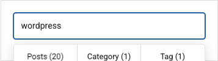
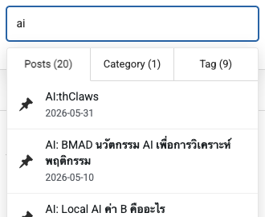
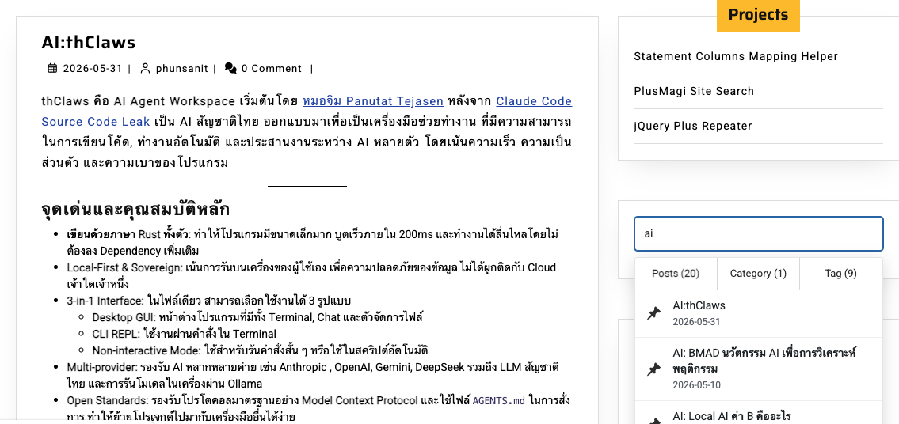

# PlusMagi Blocks

[](https://wordpress.org/plugins/plusmagi-blocks)
[](https://www.gnu.org/licenses/gpl-2.0.html)


**PlusMagi Blocks** adds focused Gutenberg blocks for diagrams, structured definitions, and semantic word references. Authors can create and preview rich technical content without leaving the WordPress editor.

## Requirements

- WordPress 6.0 or newer
- A block-enabled theme or editor

## Blocks

### Mermaid Diagram

Write Mermaid syntax and preview the generated SVG directly in Gutenberg.

- Markdown-based Mermaid editing
- Live SVG preview in the editor
- Syntax error feedback before publishing
- Multiple diagrams in the same post or page
- Responsive frontend rendering
- Sanitized SVG output
- AMP-compatible image output with intrinsic dimensions

### Description List

Create semantic definition lists using native `<dl>`, `<dt>`, and `<dd>` markup.

- Add or remove terms and descriptions in the editor
- Use nested core blocks inside descriptions
- Choose the ordered display option
- Publish accessible, semantic HTML

### Thesaurus

Build structured reference entries for words and concepts.

- Add definitions and parts of speech
- Group synonyms and antonyms
- Edit entries through Gutenberg controls
- Publish semantic thesaurus markup with dedicated frontend styles

## Installation

1. Download the latest release ZIP file.
2. In WordPress, go to **Plugins > Add New > Upload Plugin**.
3. Select the ZIP file, install it, and activate **PlusMagi Blocks**.
4. Open a post or page in the block editor.

For a manual installation, upload the plugin directory to `/wp-content/plugins/plusmagi-blocks` and activate it from the **Plugins** screen.

## Usage

### Create a Mermaid diagram

1. Open the block inserter.
2. Search for **Mermaid** or **PlusMagi**.
3. Insert **PlusMagi - Mermaid**.
4. Enter Mermaid syntax, for example:

   ```mermaid
   flowchart LR
	   Idea --> Draft
	   Draft --> Publish
   ```

5. Confirm the live preview, then publish the post.

Use one Mermaid diagram per block. For a longer document, add multiple blocks so each diagram remains easy to edit.

### Create a description list

1. Search for **Description list** in the block inserter.
2. Insert **PlusMagi - Description list**.
3. Add terms and descriptions, then use the block controls to add or remove entries.

### Create a thesaurus entry

1. Search for **Thesaurus** or **PlusMagi** in the block inserter.
2. Insert **PlusMagi - Thesaurus**.
3. Add a heading and entries with definitions, synonyms, and antonyms.

## Frontend and AMP Rendering

On standard WordPress pages, Mermaid diagrams are rendered responsively on the frontend. For AMP requests, the plugin sanitizes the generated SVG, stores it in the WordPress uploads directory, and renders it through AMP-compatible image markup.

If a diagram does not render, validate the Mermaid syntax first. Common causes include missing arrows, unmatched brackets, and invalid diagram keywords.

## Screenshots







## Development

Source repository: [github.com/phunsanit/wp-plusmagi-blocks](https://github.com/phunsanit/wp-plusmagi-blocks)

## Changelog

**1.0.0** (Initial Release)

- Added the PlusMagi Blocks plugin entry point
- Added Mermaid Diagram, Description List, and Thesaurus blocks
- Added live Mermaid preview and frontend rendering
- Added responsive SVG and AMP-compatible diagram output
- Added editor and frontend styles for structured content

## License

GPLv2 or later. See LICENSE file for details.
